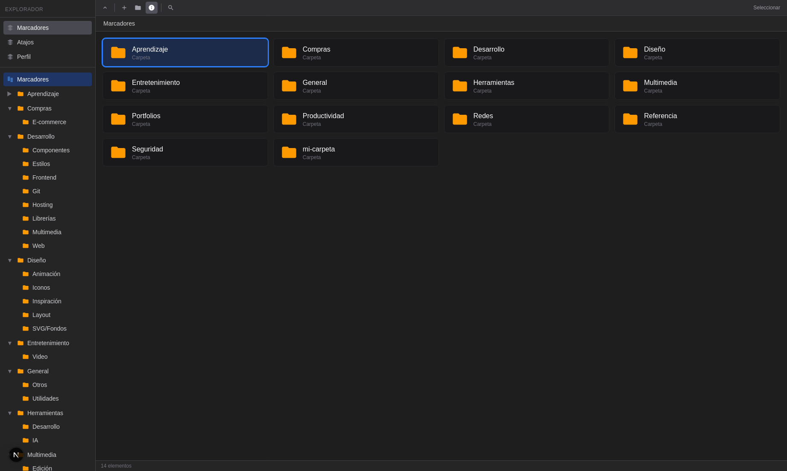

# Marcadores

Bookmark manager built with Next.js and Supabase. Organize your links in folders, use shortcuts, and browse your collection with a dark explorer-style interface.



## Demo version

You can try the app **without signing in**:

- **Local:** run `pnpm dev` without configuring `.env.local` — you'll see the "Try demo" button on the login page.
- **Online:** visit `/demo` to go directly to the main interface (requires `NEXT_PUBLIC_DEMO_MODE=true` in deployment).

The demo shows sample folders (Learning, Shopping, Development, Design, etc.) and bookmarks. Changes are stored in memory during the session.

## Usage

```bash
pnpm install
pnpm dev
```

Without `.env.local` or Supabase credentials: uses demo mode (in-memory data).

## Scripts

- `pnpm run dev` — Development server
- `pnpm run fetch:bookmarks` — Export bookmarks to stdout (e.g. `> bookmarks.json`)
- `pnpm run descriptions:generate` — Generate descriptions and tags with OpenAI for bookmarks without description
- `pnpm run db:create-table` — Create table in Supabase (requires migration)
- `pnpm run db:sql` — Print SQL to create table

## Structure

- `src/app/` — Next.js routes (login, bookmarks, shortcuts, profile, demo)
- `src/components/` — BookmarkModal, TagAutocomplete, DashboardShell, etc.
- `src/lib/demo-data.ts` — Sample data for demo mode

## Environment variables

Copy `.env.example` to `.env.local` and fill in Supabase credentials.

| Variable | Description |
|----------|-------------|
| `NEXT_PUBLIC_SUPABASE_URL` | Supabase project URL |
| `NEXT_PUBLIC_SUPABASE_ANON_KEY` | Supabase anonymous key |
| `NEXT_PUBLIC_SITE_URL` | Site URL (for Open Graph when sharing) |
| `NEXT_PUBLIC_DEMO_MODE` | `true` to force demo mode in production |

## Documentation

- [Español](README.md)
