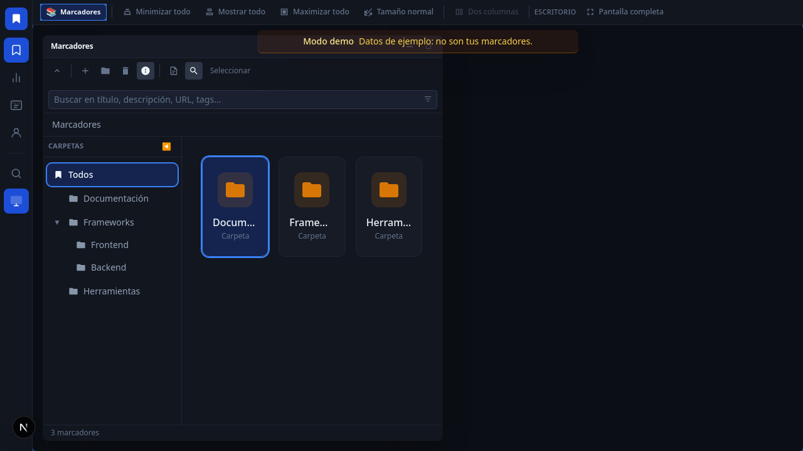

# Marcadores

[English version](./README.EN.md)

**Sitio publicado:** [web-marcadores.vercel.app](https://web-marcadores.vercel.app)



Gestor de marcadores y favoritos con Next.js y Supabase. Organiza enlaces en carpetas, usa atajos y recorre la colección
con una interfaz oscura tipo explorador. Puedes usar **modo demo** sin configurar Supabase.

Con esta carpeta como raíz del workspace en Cursor, los comandos `/update-docs` y `/auto-commit` están en
[`.cursor/commands/`](.cursor/commands/) para mantener documentación bilingüe y commits alineados al repo.

## ✨ Características

- Carpetas anidadas, cuadrícula de marcadores y panel de detalle con metadatos y etiquetas
- **Papelera** con soft-delete y retención de 30 días
- **Agent API + MCP remoto** (PAT `wm_…`) — ver [docs/ops/mcp-agent.md](./docs/ops/mcp-agent.md)
- Autenticación con Supabase y sesión SSR mediante `@supabase/ssr`
- **Modo demo** sin `.env.local`: datos en memoria y acceso por botón en login o ruta `/demo` (en producción puedes
  forzar con `NEXT_PUBLIC_DEMO_MODE=true`)
- Atajos de teclado y vistas de **Atajos** y **Perfil**
- Interfaz coherente con Tailwind CSS v4

## 🛠️ Tecnologías

- **Next.js** 16 (App Router), **React** 19, **TypeScript**
- **Supabase** (`@supabase/supabase-js`, `@supabase/ssr`)
- **Tailwind CSS** v4 con PostCSS
- **pnpm** (lockfile en el repositorio)
- Calidad: ESLint (`eslint-config-next`), Prettier, `react-doctor`

## 🚀 Desarrollo local

```bash
pnpm install
pnpm dev
```

Otros scripts útiles:

- `pnpm run build` / `pnpm run start` — compilación y servidor de producción
- `pnpm run lint` / `pnpm run lint:fix` — ESLint
- `pnpm run format` / `pnpm run format:check` — Prettier
- `pnpm run react:doctor` — diagnóstico de React

Sin `.env.local` o sin credenciales Supabase válidas se activa el modo demo (datos en memoria).

## 📁 Estructura del proyecto

```text
.
├── public/                          # assets estáticos
│   ├── favicon.svg
│   └── screenshots/                 # capturas por apartado (login, README, OG en /public)
│       ├── marcadores.png
│       ├── marcadores-mobile.png
│       ├── atajos.png
│       ├── estadisticas.png
│       └── perfil.png
├── src/app/                         # App Router
│   ├── page.tsx                     # / login
│   ├── layout.tsx
│   ├── globals.css
│   ├── demo/page.tsx                # entrada /demo → redirección con cookie
│   └── (dashboard)/                 # rutas bajo shell del dashboard
│       ├── layout.tsx
│       ├── marcadores/page.tsx
│       ├── atajos/page.tsx
│       └── perfil/page.tsx
├── src/features/                    # UI por dominio — login, marcadores, atajos, perfil
│   ├── login/                       # LoginPage, useLogin, types
│   ├── marcadores/                  # página principal, hooks, toolbar, grid…
│   │   └── components/
│   │       ├── bookmark/            # modal, panel detalle, tags…
│   │       └── explorer/            # árbol del explorador lateral
│   ├── atajos/                      # AtajosPage, data de atajos
│   └── perfil/                      # PerfilPage, hooks de usuario y auth
├── src/components/                  # UI global del dashboard
│   └── header/                      # cabecera móvil, explorador ancho, dashboardNav
├── src/layouts/dashboard/           # shell del dashboard (sidebar, composición)
│   ├── sidebar/                     # nav, drawer móvil, utilidades del árbol
│   └── shell/                       # DashboardShell + DashboardMobileLayout
├── src/lib/
│   ├── supabase/client.ts           # cliente browser
│   ├── demo-data.ts
│   ├── bookmark-utils.ts
│   └── bookmark-tags.ts
├── src/contexts/
│   └── DashboardContext.tsx
├── src/proxy.ts                     # demo (cookies), rutas protegidas, Supabase SSR
├── .env.example
├── package.json
├── next.config.ts
├── vercel.json
├── tsconfig.json
├── eslint.config.mjs
├── postcss.config.mjs
└── .prettierrc.mjs
```

## 🎯 Áreas de contenido

- **`/`** — inicio de sesión (o acceso demo)
- **`/marcadores`** — vista principal del explorador de carpetas y marcadores
- **`/atajos`** — página de atajos
- **`/perfil`** — perfil y acciones de cuenta
- **`/demo`** — redirección al dashboard con cookie de sesión demo

## 📝 Información

Copia `.env.example` a `.env.local` y rellena las variables si usas Supabase fuera del modo demo.

| Variable                        | Descripción                                              |
| ------------------------------- | -------------------------------------------------------- |
| `NEXT_PUBLIC_SUPABASE_URL`      | URL del proyecto Supabase                                |
| `NEXT_PUBLIC_SUPABASE_ANON_KEY` | Clave anónima de Supabase                                |
| `NEXT_PUBLIC_SITE_URL`          | URL del sitio (Open Graph; por defecto Vercel en código) |
| `NEXT_PUBLIC_DEMO_MODE`         | `true` para forzar modo demo en producción               |

## FraVelz

- **GitHub:** [@FraVelz](https://github.com/FraVelz)
- **Repositorio:** [WEB-Marcadores](https://github.com/FraVelz/WEB-Marcadores)

## 🙏 Contribuciones

Las mejoras y correcciones son bienvenidas mediante issues o pull requests en el repositorio.

---

Si te resulta útil el proyecto, una estrella en GitHub ayuda a darle visibilidad.

> Este documento fue generado o actualizado con asistencia de inteligencia artificial. Última actualización: **10 de
> mayo de 2026**.
